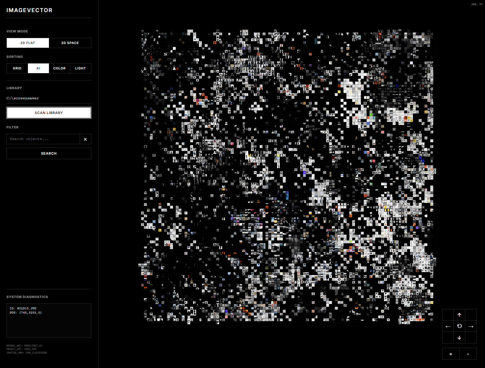

# ImageVector

**ImageVector** is a minimalist, browser-based tool for exploring and organizing large image libraries in 2D and 3D space. It uses fully offline AI to analyze visual features, colors, and content, arranging images into intuitive clusters.



## Features

*   **AI Semantic Clustering**: Organizes images by visual similarity using CLIP embeddings and a Self-Organizing Map (SOM).
*   **Chromatic Sorting**: 3D clustering based on dominant colors.
*   **Timeline Visualization**: Interactive 3D "Time Ribbon" to explore your library chronologically.
*   **Smart Search**: Type a keyword, and the camera automatically navigates to the visual center of matching images using CLIP's zero-shot classification.
*   **Deep Interaction**:
    *   **Shift+Click** to reveal semantic neighbors.
    *   **Depth Control** to expand/compress 3D clusters.
*   **Minimalist Design**: Distraction-free, strict monochrome interface.
*   **100% Offline & Private**: All AI analysis happens locally in your browser using Transformers.js and CLIP. No cloud connections, no API keys required, no data leaves your machine.

## Installation

1.  Clone the repository:
    ```bash
    git clone https://github.com/yourusername/imagevector.git
    cd imagevector
    ```

2.  Install dependencies:
    ```bash
    npm install
    ```

3.  Start the local server:
    ```bash
    npm start
    ```

4.  Open your browser at `http://localhost:3000`.

## Usage

1.  Enter the absolute path to your local image folder (e.g., `C:/Photos`).
2.  Click **Scan Library**. The app will analyze your images (this may take a few minutes for the first run).
3.  Use the **View** toggle to switch between 2D Grid and 3D Cloud.
4.  Use the **Sorting** controls to switch between Semantic, Color, and Time modes.

## Technologies

*   **Frontend**: Vanilla JavaScript, CSS3 (3D Transforms), Transformers.js
*   **Backend**: Node.js, Express (for file access)
*   **AI Models**: CLIP (ViT-Base-Patch32) for visual embeddings and zero-shot classification

## License

MIT
